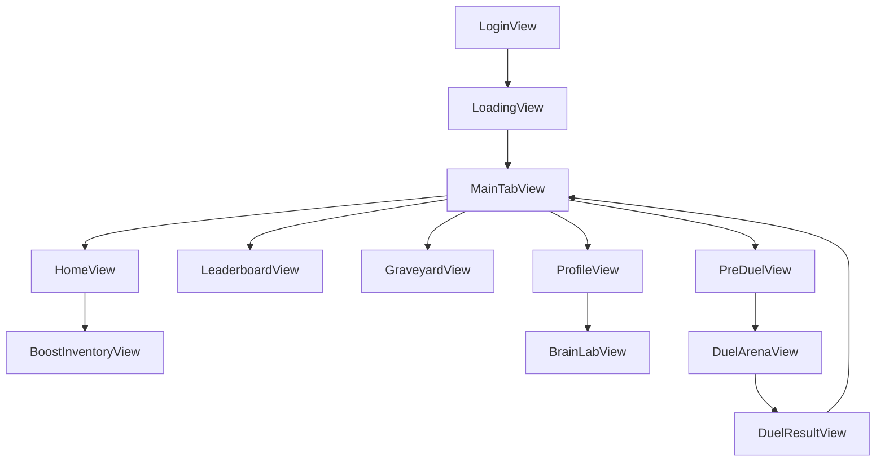

# Recent Changes Reproduction Guide (ScrollClash)

This guide explains how to reproduce the latest shipped update in this repository, including architecture decisions, file-level changes, and validation steps.

## Reference Snapshot

- Repo: `ScrollClash`
- Scope: web app remains intact; native iOS implementation is under `ios-native/` only
- Baseline context: existing React web app in `src/`
- Reproduction target: native iOS parity scaffold + feature-complete screen set + post-build stability fixes

---

## What Was Built

This update delivered a native iOS app implementation for ScrollClash with parity to the web app's user-facing flows and visuals, plus compile/runtime hardening.

1. Native iOS project scaffold under `ios-native/ScrollClash.xcodeproj`.
2. Full feature surface implemented in SwiftUI:
   - Auth flow (Login, Loading),
   - Main tabs (Home, Leaderboard, Graveyard, Profile),
   - Duel flow (Pre-Duel, Duel Arena, Duel Result),
   - Overlays (Brain Lab, Boost Inventory).
3. Shared design system and reusable components:
   - neon theme tokens,
   - brain character renderer,
   - game icon set,
   - progress/animation primitives.
4. Data modeling and mock-data parity with web app (no backend required for current behavior).
5. Build and runtime hardening:
   - resolved compile issue in `BrainCharacterView.swift`,
   - resolved unsupported SF Symbol usage (`skull.fill`),
   - removed nested full-screen presentation causing orientation transaction warnings,
   - improved DuelArena safe-area behavior and overlay visibility,
   - optimized striped background rendering behavior.

---

## Changed Files (by domain)

## Documentation

- `ios-native/PORTING_INVENTORY.md`
- `ios-native/PORTING_PROGRESS.md`
- `RECENT_CHANGES_REPRODUCTION_GUIDE.md` (this file)

## App Foundation + Navigation

- `ios-native/ScrollClash/App/ScrollClashApp.swift`
- `ios-native/ScrollClash/App/RootView.swift`
- `ios-native/ScrollClash/App/MainTabView.swift`
- `ios-native/ScrollClash/App/AppState.swift`

## Data Models + Mock Data

- `ios-native/ScrollClash/Models/Models.swift`
- `ios-native/ScrollClash/Models/MockData.swift`

## Design System + Shared Components

- `ios-native/ScrollClash/Shared/Theme/NeonTheme.swift`
- `ios-native/ScrollClash/Shared/Components/BrainCharacterView.swift`
- `ios-native/ScrollClash/Shared/Components/GameIcons.swift`
- `ios-native/ScrollClash/Shared/Components/ProgressRingView.swift`
- `ios-native/ScrollClash/Shared/Components/AnimatedNumberView.swift`

## Feature Screens

- `ios-native/ScrollClash/Features/Auth/Views/LoginView.swift`
- `ios-native/ScrollClash/Features/Auth/Views/LoadingView.swift`
- `ios-native/ScrollClash/Features/Home/Views/HomeView.swift`
- `ios-native/ScrollClash/Features/Leaderboard/Views/LeaderboardView.swift`
- `ios-native/ScrollClash/Features/Graveyard/Views/GraveyardView.swift`
- `ios-native/ScrollClash/Features/Profile/Views/ProfileView.swift`
- `ios-native/ScrollClash/Features/Duel/Views/PreDuelView.swift`
- `ios-native/ScrollClash/Features/Duel/Views/DuelArenaView.swift`
- `ios-native/ScrollClash/Features/Duel/Views/DuelResultView.swift`
- `ios-native/ScrollClash/Features/BrainLab/Views/BrainLabView.swift`
- `ios-native/ScrollClash/Features/Boosts/Views/BoostInventoryView.swift`

## Project Generation / Wiring

- `ios-native/ScrollClash.xcodeproj/project.pbxproj`
- `ios-native/ScrollClash/Assets.xcassets/Contents.json`
- `ios-native/ScrollClash/Assets.xcassets/AppIcon.appiconset/Contents.json`

---

## Exact Rebuild Sequence

Use this sequence to replay the delivered state from the existing web app.

## 1) Start from current repo root

```bash
cd /path/to/ScrollClash
```

## 2) Keep web app unchanged, create iOS-native workspace

Create and preserve all work under `ios-native/` only:

- `ios-native/ScrollClash.xcodeproj`
- `ios-native/ScrollClash/...` (Swift source tree)
- `ios-native/PORTING_INVENTORY.md`
- `ios-native/PORTING_PROGRESS.md`

## 3) Add app shell and shared state

Implement:

- `ScrollClashApp.swift` -> app entry point
- `RootView.swift` -> login/loading/main-tab flow
- `MainTabView.swift` -> bottom nav with center Duel CTA
- `AppState.swift` -> `ObservableObject` with `BrainCustomization` and login state

## 4) Add design system and reusable components

Implement:

- `NeonTheme.swift` (colors, gradients, card/text style helpers, striped background)
- `BrainCharacterView.swift` (customizable mascot rendering)
- `GameIcons.swift`, `ProgressRingView.swift`, `AnimatedNumberView.swift`

## 5) Add models + mock data parity

Implement:

- `Models.swift` for all app structs (`Boost`, `DuelOpponent`, `UserProfile`, etc.)
- `MockData.swift` with hardcoded values used by all screens

## 6) Build all feature screens

Implement all screen groups:

- Auth: `LoginView`, `LoadingView`
- Tabs: `HomeView`, `LeaderboardView`, `GraveyardView`, `ProfileView`
- Duel: `PreDuelView`, `DuelArenaView`, `DuelResultView`
- Overlays: `BrainLabView`, `BoostInventoryView`

## 7) Runtime hardening pass (must include)

Apply these stability fixes:

1. `skinColor` name-collision fix in `BrainCharacterView.swift`
   - disambiguate call to module-level helper using `ScrollClash.skinColor(for:)`.
2. SF Symbols compatibility fix
   - replace unsupported `skull.fill` with a supported alternative (`moon.fill`) in:
     - `MainTabView.swift`
     - `GraveyardView.swift`
     - `GameIcons.swift`
3. Duel presentation stack fix
   - remove nested `fullScreenCover` chain in duel flow:
     - `PreDuelView` should swap into `DuelArenaView` inline via `ZStack` state
     - `DuelArenaView` should present result inline overlay instead of nested full-screen modal.
4. Duel layout/safe-area fix
   - in `DuelArenaView`, use `GeometryReader` safe area for top HUD and bottom boost row spacing.
5. Background rendering hardening
   - in `NeonTheme.swift`, move stripe rendering into a composited layer (`drawingGroup`) to reduce repeated rendering invalidation behavior.
6. Home boost navigation wiring
   - ensure `HomeView` presents `BoostInventoryView` via `fullScreenCover` from outer container level and passes environment object where needed.

## 8) Keep tracking docs in sync

Update:

- `ios-native/PORTING_INVENTORY.md` (route/component/api/asset mapping)
- `ios-native/PORTING_PROGRESS.md` (completion checklist + known limits + build status)

---

## Screen and Flow Architecture



---

## Validation Checklist (must pass)

## Build

```bash
cd ios-native
xcodebuild -project ScrollClash.xcodeproj -scheme ScrollClash -destination "generic/platform=iOS Simulator" -derivedDataPath ./DerivedData build
```

Expected: `BUILD SUCCEEDED`.

## Functional

- Login -> Loading -> Main tabs flow works.
- Center duel CTA opens Pre-Duel flow.
- Pre-Duel transitions into Duel Arena.
- Forfeit and end-of-match transition into Duel Result.
- Home "Boost Deck" opens Boost Inventory and returns correctly.
- Graveyard scene toggle works for Healthy/Graveyard.
- Profile -> Brain Lab customization flow works.

## Stability

- No runtime warnings about unsupported SF Symbols (`skull.fill`).
- No repeated orientation transaction warning from nested full-screen presentations during duel flow.
- No obvious HUD clipping on top/bottom safe areas in Duel Arena.
- No app crash from missing mock data.

---

## Backend Integration Readiness Notes

Current app behavior is intentionally mock-data driven. To integrate your friend's backend, plug network services into these points:

- Matchmaking trigger/state:
  - `ios-native/ScrollClash/Features/Duel/Views/PreDuelView.swift`
- Duel real-time state (HP, timers, events):
  - `ios-native/ScrollClash/Features/Duel/Views/DuelArenaView.swift`
- Leaderboard fetch:
  - `ios-native/ScrollClash/Features/Leaderboard/Views/LeaderboardView.swift`
  - `ios-native/ScrollClash/Models/MockData.swift`
- Profile fetch/update:
  - `ios-native/ScrollClash/Features/Profile/Views/ProfileView.swift`
  - `ios-native/ScrollClash/App/AppState.swift`
- Boost catalog/deck persistence:
  - `ios-native/ScrollClash/Features/Boosts/Views/BoostInventoryView.swift`
  - `ios-native/ScrollClash/Models/MockData.swift`

Recommended integration order:
1. Matchmaking + duel session APIs,
2. Leaderboard/profile APIs,
3. boost deck persistence,
4. auth/session hardening.

---

## Operational Notes

- Web app source (`src/`) remains unchanged and serves as visual/product reference.
- Native iOS implementation is isolated to `ios-native/`.
- `ios-native/DerivedData` is generated build output and should not be treated as source.
- Current implementation targets iOS 16+ with SwiftUI and async-style task loops.
